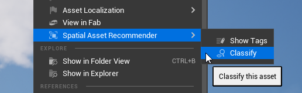
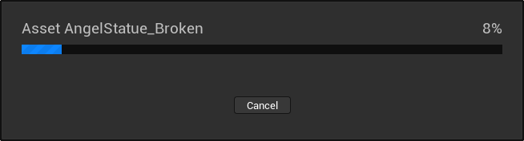

[← Previous](../Context-Assets/index.md) | [Start](../index.md) | [Next →](../View-Tags-for-an-Asset/index.md)

# Classify Assets from the Content Browser

It is possible to run the classifier for specific assets by navigating to `Spatial Asset Recommender` &rarr; `Classify` in the context menu for assets.
This will use the classification configuration that applies to the selected assets according to [your configuration](../Setup-Classifiers/index.md).
Selected assets that can't be classified will be ignored.

Depending on the classifier setup, the classification will take some time.
During this time the editor will be blocked and a loading bar will be displayed.
You can cancel the classification process, but the system will always complete the classification of the asset that's currently being processed. Therefore, cancellation may take some time.

[Next →](../View-Tags-for-an-Asset/index.md)
