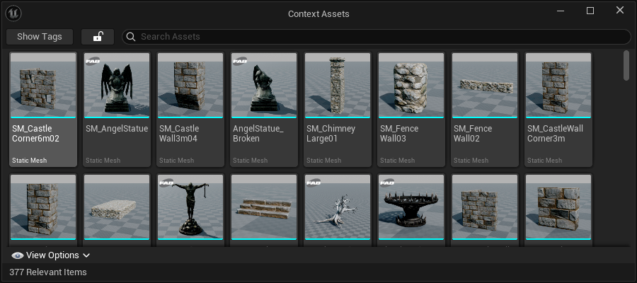
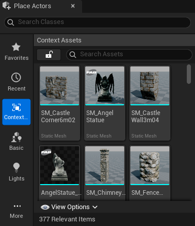
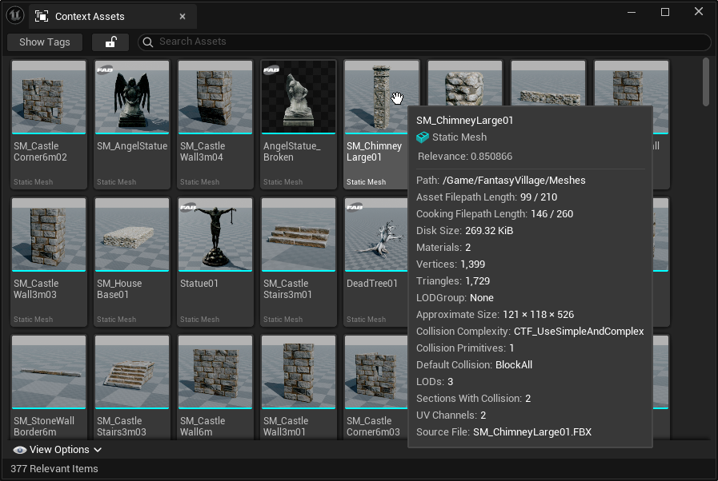
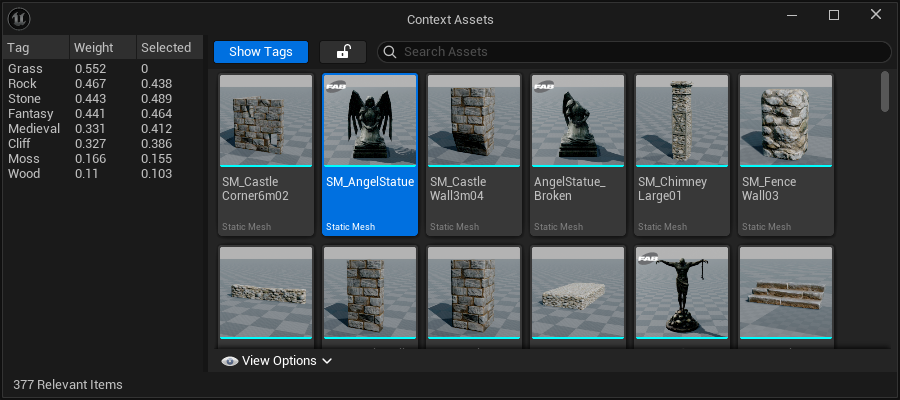

[← Previous](../Context-Assets/index.md) | [Start](../index.md) | [Next →](../Classify-Assets-from-the-Content-Browser/index.md)

# Context Assets Window

This window can be found in `Tools` &rarr; `Context Assets` or the _Place Actors_ panel under the same name.

This window is straightforward to understand, as it behaves a lot like the Content Browser.
It displays assets that match the current level viewport situation and provides features for filtering that list and comparing the _weighted tags_ of the current situation and specific assets (see below).

Hovering over an asset gives a standard tooltip, but with a "relevance" value which shows how similar this asset is to the current viewport context.
The assets in the _Context Assets_ window are sorted according to this value.

## Drag and Drop

One of the core philosophies of the _Spatial Asset Recommender_ is to provide a seamless and smooth workflow for anyone who needs to place or assign assets in a level.
For that purpose, it supports easy drag-and-drop behavior of assets from both the _Place Actors_ panel and the dedicated _Context Assets_ window.

## Compare Tags

By clicking on the `Show Tags` button, it is possible to view the calculated _weighted tags_ of the most recent level viewport.
In addition to that, when the user selects an asset in the _Context Assets_ window, the weights associated with the tags of that asset are added to the same table for easy comparison.
Missing tags are displayed with a value of 0.

[Next →](../Classify-Assets-from-the-Content-Browser/index.md)