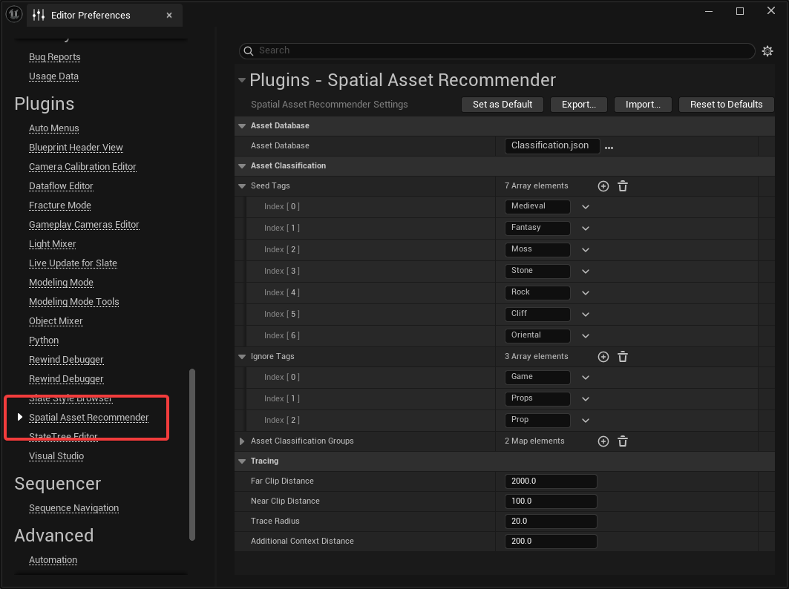
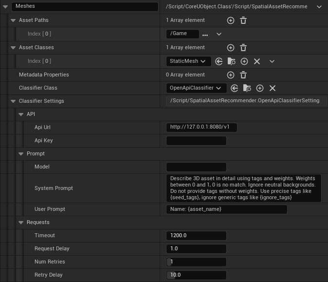

[← Previous](../View-Tags-for-an-Asset/index.md) | [Start](../index.md) | [Next →](../Run-the-Classify-Commandlet/index.md)

# Setup Classifiers

The classifiers can be set up in the `Editor Preferences` &rarr; `Spatial Asset Recommender`.
The configuration will be saved in the `EditorPerProjectUserSettings.ini` file and can be handled like any other Unreal config file.
This means that when changing this file, it'll be changed in `(Project)/Saved/Config`.
If you want to share the settings with your team, click the _Set as Default_ button to save it in `(Project)/Config/DefaultEditorPerProjectUserSettings.ini`, then check the file into _source control_.

Inside these settings, you have _global_ settings and _per classification group_ settings.

## Global settings

- `Asset Database`: This is the path to a JSON file that contains all the classification results for all classified assets. Its path is relative to your `Project.uproject` file. To share this file with your team, check it into _source control_.
- `Seed Tags`: Some classifiers can do a better job if they have a list of starting tags. This should be adjusted to your project needs. A basic default is set.
- `Ignore Tags`: Some classifiers can do a better job if they know which tags to ignore. For example, you can set overly generic tags like "Game" or "Prop."

The `Asset Classification Groups` is used to set up different categories of assets that have a common classifier setup. See the [next section](#Per-classification-group-settings).

To derive the current context from the level viewport, _Spatial Asset Recommender_ uses the viewport frustum and some traces.
It is possible to fine-tune this behavior using the following settings:

- `Far Clip Distance` and `Near Clip Distance`: This is the farthest and the closest distance of assets that are considered "in context."
- `Trace Radius`: This is the radius of the sphere trace that's used to find the actual context distance. The actual context distance is the distance of the scene from the viewport center.
- `Additional Context Distance`: A fraction of this value is added to the context distance. The further away the hit target is from the viewpoint, the more of this value is added to the context distance.

A level is never a flat plane, and the distance of the level geometry from the viewport is rarely the same as the center distance we got from the sphere trace.
The _Additional Context Distance_ can be used to increase the context to improve the accuracy.

## Per classification group settings

Each classification group has a unique name that's only used for you to distinguish them.
Other than that, each classification group has its own set of settings:

- `Asset Paths`: Array of paths that contain assets that should be affected by this group.
- `Asset Classes`: Array of object types that are affected by this group.
- `Metadata Properties`: Named object properties that should be considered as additional context for the classifier. If the asset object has a property named "MyProperty," you can use that exact name here. 
- `Classifier Class`: This classifier should be used for this group. See [Default Classifiers](../Default-Classifiers/index.md) or [Write your own Classifier](../Write-your-own-Classifier/index.md) for more details.
- `Classifier Settings`: This is an inline object that's automatically filled in depending on the selected _classifier class_. It provides additional classifier-specific settings.

---

These settings will be applied when using the [Content Browser classification routine](../Classify-Assets-from-the-Content-Browser/index.md), as well as the [commandlet](../Run-the-Classify-Commandlet/index.md).

[Next →](../Run-the-Classify-Commandlet/index.md)