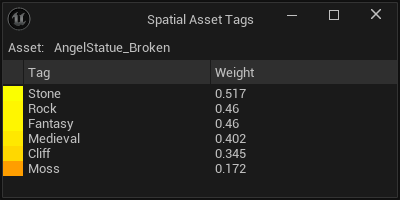

[← Previous](../Classify-Assets-from-the-Content-Browser/index.md) | [Start](../index.md) | [Next →](../Setup-Classifiers/index.md)

# View Tags for an Asset

Right now, it is possible to view the tags for a specific asset.
To open that window, right-click the asset in the standard content browser, and in the context menu:
`Spatial Asset Recommender` &rarr; `Show Tags`.

This window shows the name of the asset, and a full list of all tags and their weights.

[Next →](../Setup-Classifiers/index.md)
